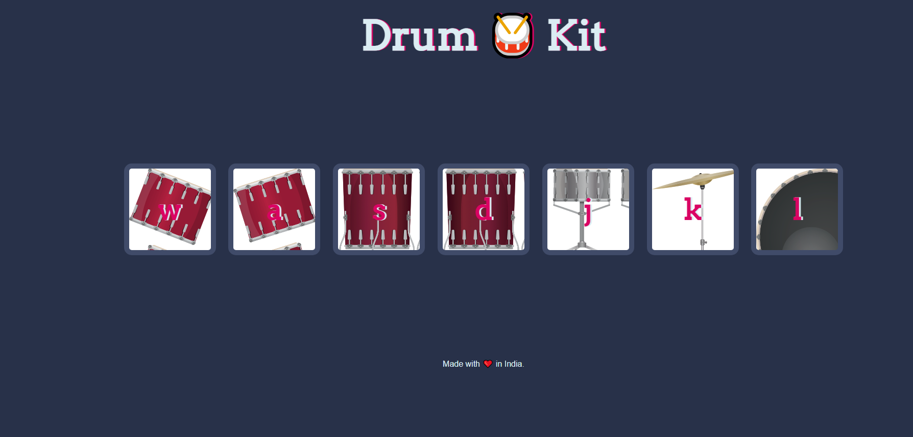

# Drum Kit 🥁

A fun and interactive drum kit web application that lets you play different drum sounds using your keyboard! Built with **HTML**, **CSS**, and **JavaScript**, this project is perfect for music enthusiasts and beginners learning web development.



---

## Features
- Play drum sounds by pressing the corresponding keyboard keys.
- Interactive and responsive design.
- Displays key mappings for easy reference.
- Perfect for quick fun and learning about event listeners in JavaScript.

---

## How to Use
1. Clone the repository or download the files.
2. Open the `index.html` file in your browser.
3. Use the following keys to play:
   - `W`, `A`, `S`, `D`, `J`, `K`, `L`
4. Have fun creating your beats!

---

## Tech Stack
- **HTML**: Structure of the page.
- **CSS**: Styling and layout.
- **JavaScript**: Interactivity and sound functionality.

---

## Installation
1. Clone the repository:
   ```bash
   git clone https://github.com/abdulaarizaman/drum-kit.git
